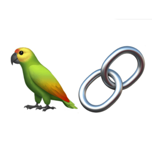
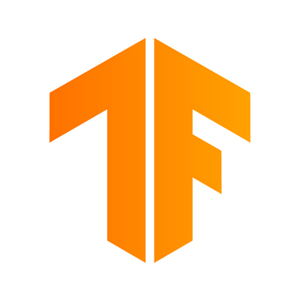
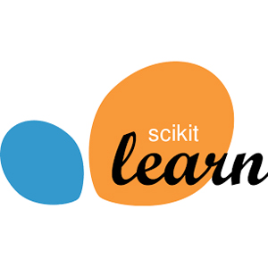
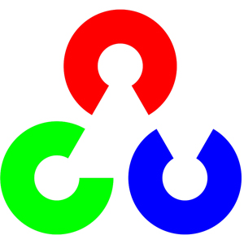
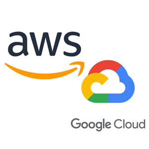

### Hello there 👋
- ⚡ML engineer/Data engineer.
- 🌱Deep knowledge in ML: LLM's, Agents, Ethical AI, Transformers, scikit-learn. Experience with classic ML algorithms (linear regression, logistic
regression, SVMs, nearest neighbor, decision trees, PCA, and k-means clustering), also CNN's, RNN's,
LSTM's, auto encoders, auto decoders.
- 🌱Knowledge in Probability Theory, Linear Algebra, Statistics, Mathematical analysis.

- 📫 You can reach me by:

<h3 align="left">⚡ Main skills:</h3>

<table align="center">
    <tr>
        <td align="center" width="140" height="112.43">
            
              LangChain
        </td>
        <td align="center" width="140" height="112.43">
            
              PyTorch
        </td>
        <td align="center" width="140" height="112.43">
            
              TensorFlow
        </td>
        <td align="center" width="140" height="112.43">
            
              Tableau
        </td>
        <td align="center" width="140" height="112.43">
            
              Scikit Learn
        </td>
        <td align="center" width="140" height="112.43">
            
              OpenCV
        </td>
        <td align="center" width="140" height="112.43">
            
              GCP|AWS
        </td>
    </tr>
</table>

<h3 align="left">Programming:</h3>

    
    
    
    
    
<h3 align="left">Web Servers:</h3>

   

<h3 align="left">Framework & Libraries:</h3>

  </img>
  </img>
  </img>
  </img>
  </img>
  </img>
  </img>
  </img>
  </img>
  </img>

    

<h3 align="left">Databases:</h3>

    
    

<h3 align="left">Virtualization Platforms:</h3>

    
    
    

<h3 align="left">Software and tools:</h3>

    
    <a href="#"></img></a>
    <a href="#"></img></a>
    
    
    
    
    
    

<h3 align="left">Linux Distributions:</h3>

    
    

<h3 align="left">Cloud Providers:</h3>

    
    

